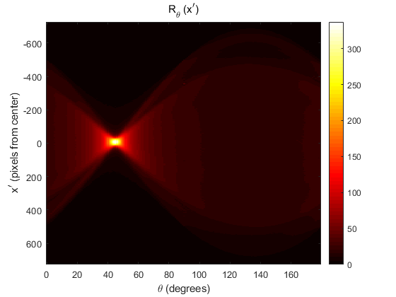

# Finding the angle of a line (Matlab)
### Using a Radon transform

This code is a simple example of finding the angle of a line in an image using a Radon transform.
 * [Radon transform](https://en.wikipedia.org/wiki/Radon_transform)
  
## Results
|Test image|
|:---:|
||

|Result of Radon transform|
|:---:|
||

<pre>
The angle of the line is 45
</pre>